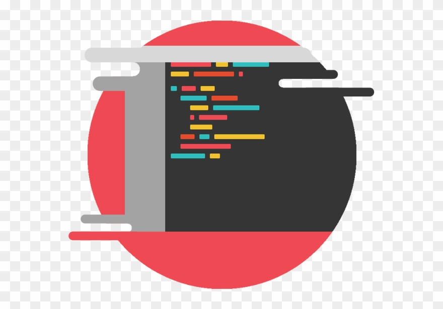

<h1>My LeetCode Practices</h1> 

<h1 align="center"></h1>

<h2 align="center">My Database of completed LeetCode Challenges</h2>
<h5>Feel free to browse through my thought process on how I completed them!</h5>
